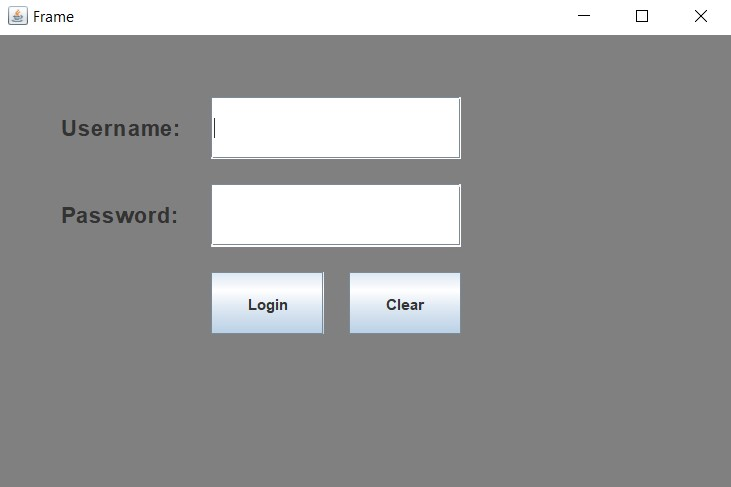
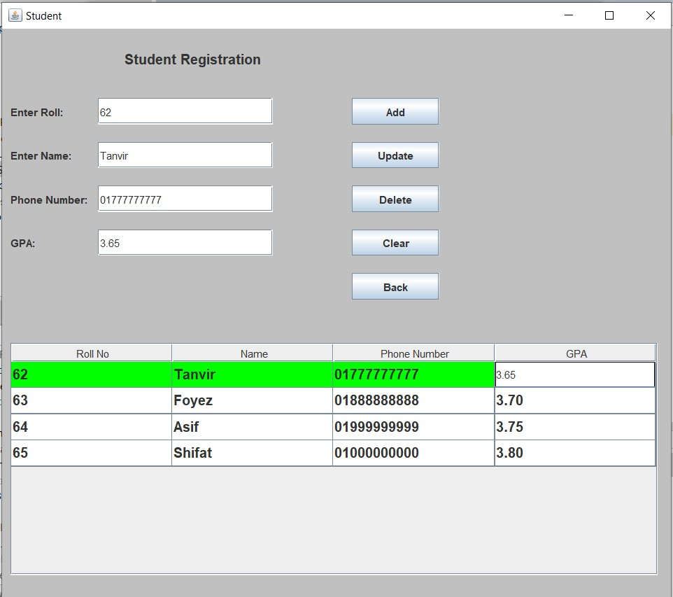

# 🎓 Student Result Management System




## 📘 Overview

**Student Result Management System** is a simple desktop-based Java Swing application that allows a user to input, update, delete, and organize student data. This project is designed with a minimal and clean interface consisting of a login page and a main dashboard for managing student records.

> ⚠️ **Note**: This project is interface-only. Data is not saved to any file or database, meaning all data will be lost once the application is closed. This limitations will be solved In sha Allah.

---

## 🚀 Features

- 🔐 **User Login Interface**
  - Simple username and password login window
  - No backend validation yet (can be extended)

- 📝 **Student Information Management**
  - Collect and manage:
    - ✅ Roll No
    - ✅ Name
    - ✅ Phone Number
    - ✅ GPA
  - Perform:
    - ➕ Add student record
    - ✏️ Update existing student data
    - ❌ Delete a student record
    - ♻️ Clear input fields
    - 🔙 Go back from the interface

- 📊 **Data Table**
  - Displays all entered student records in a structured table
  - Allows sorting based on any column (ascending or descending)

---

## 🛠️ Technologies Used

- Java (JDK 8 or higher)
- Java Swing (for GUI)
- JTable (for table display and sorting)

---

## 🖼️ Interface Description

### 1. Login Page
- Fields:
  - `Username`
  - `Password`
- Buttons:
  - `Login`
  - `Clear`

### 2. Student Dashboard
- Input Fields:
  - Roll Number
  - Name
  - Phone Number
  - GPA
- Functional Buttons:
  - Add
  - Update
  - Delete
  - Clear
  - Back
- Table View:
  - Displays all entries in a sortable format
  - Highlights the currently selected record

---

## 💡 Limitations

- ❌ No file or database integration yet
- ❌ Data will be lost once the app is closed
- ✅ Great for interface practice and future integration with databases (e.g., SQLite, MySQL, or file I/O)

---

## 🧑‍💻 How to Run

1. Clone the repository:
   ```bash
   https://github.com/Tanvir-Mahamood/Base-Converter-System.git
   ```

2. Open the project in any Java IDE (e.g., IntelliJ IDEA, Eclipse, NetBeans)
3. Compile and run the BaseConverter.java file
4. Use the GUI to input a number and select base conversions

## 📂 Project Structure
```css
Project/
├── src/
│   └── project
|       └── LogIn.java
|       └── Student.java
└── LICENSE
└── README.md
```

## 📄 License
This project is open source and available under the [MIT License](LICENSE).

## 🙋‍♂️ Author
Tanvir Mahamood <br>
CSE Undergraduate <br>
RUET, Bangladesh
