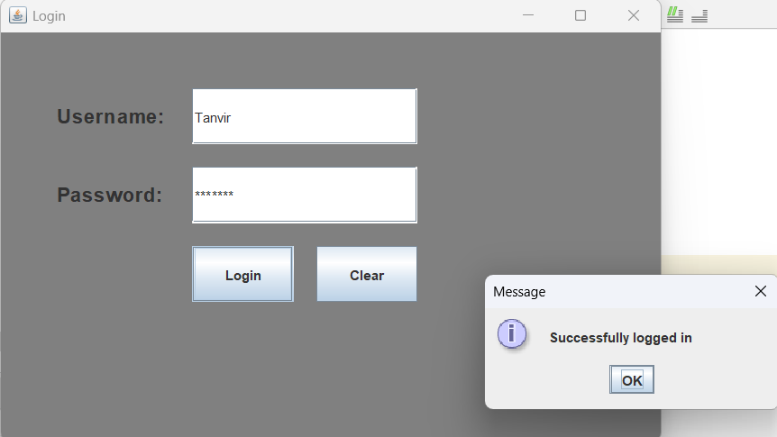
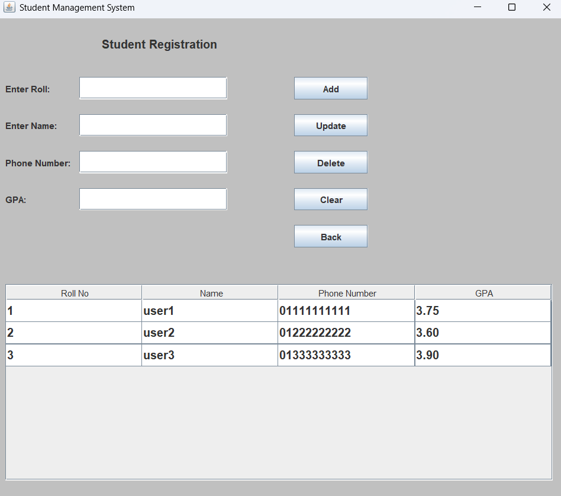

# Student Result Management

## Overview
The **Student Result Management** project is a Java Swing application that provides a user-friendly interface for managing student records. It includes a login system, a dashboard for viewing and managing student entities, and persistent storage for data.

## Features
- **Login System**: Users must enter a valid username and password to access the application.
- **Dashboard**: After logging in, users can view, insert, delete, and modify student records.
- **Student Entities**: Each student record includes:
  - Roll No
  - Name
  - Phone Number
  - CGPA
- **Sorting**: Users can sort student records in ascending or descending order based on any column.
- **Persistent Storage**: Student records are saved in `students_data.txt` and are automatically loaded when the application starts.
- **Concurrent Saving**: Changes to student records are saved automatically without manual intervention.
- **User Management**: Login information is stored in `users.txt`.

## Porject Images



## File Structure
- `src/project3_1/LogIn.java`: Contains the login functionality.
- `src/project3_1/Student.java`: Manages the dashboard and student records.
- `students_data.txt`: Stores student entities permanently.
- `users.txt`: Contains user login information.
- `login.png`: Image for the login interface.
- `dashboard.png`: Image for the dashboard interface.

## Getting Started
1. Clone the repository:
   ```bash
   git clone <repository-url>
   ```
2. Navigate to the project directory:
   ```bash
   cd Student-Result-Management
   ```
3. Compile the Java files:
   ```bash
   javac -d build src/project3_1/*.java
   ```
4. Run the application:
   ```bash
   java -cp build project3_1.LogIn
   ```

## Contributing
Contributions are welcome! Please open an issue or submit a pull request for any enhancements or bug fixes.

## License
This project is licensed under the MIT License - see the [LICENSE](LICENSE) file for details.

## Acknowledgments
- Java Swing for the GUI framework.
- File handling in Java for persistent storage.

---

Feel free to reach out for any questions or suggestions!